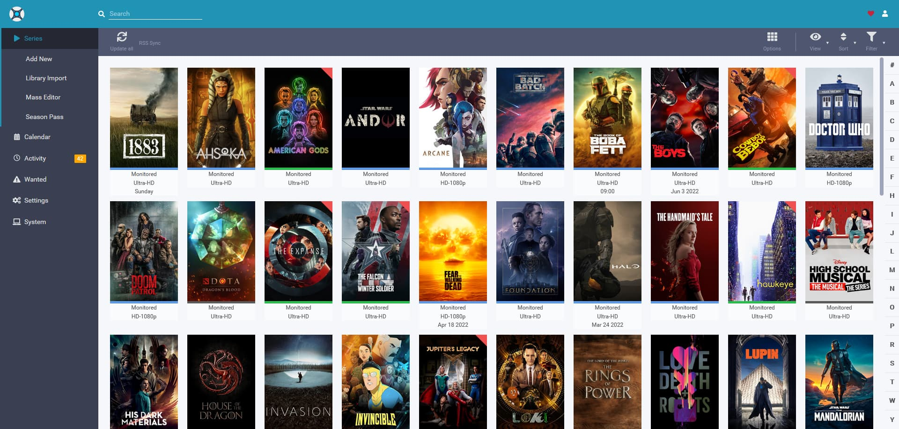
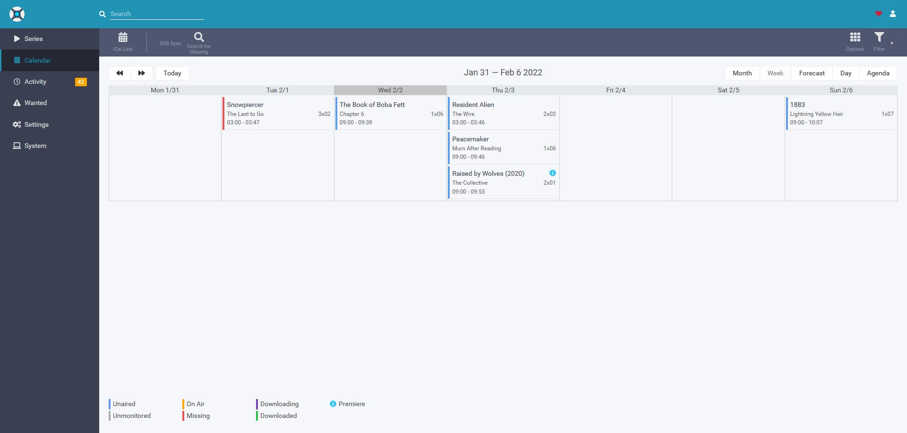

# Don't use this :-)

Better containers are out there, you should use [linuxserver/sonarr](https://github.com/linuxserver/docker-sonarr)
instead.

# Sonarr

Sonarr is a PVR for Usenet and BitTorrent users. It can monitor multiple RSS feeds for new episodes of your favorite
shows and will grab, sort and rename them. It can also be configured to automatically upgrade the quality of files
already downloaded when a better quality format becomes available.

## Docker

This Docker image is using the [Arch Linux](https://hub.docker.com/_/archlinux/) as base image. Sonarr runs as a user
with the id `1000`.

## How to get hardlinks working

Your directory structure should look like this:
You want to pass /media to the container. If you use two different volumes hardlinks and atomic moves will not work.

```
/media
    /torrents
        (Where your torrent client stores your downloads)
    /tvshows
        (Where Sonarr stores your TV shows)
```

## Ports

| Port     | Description | Required |
| -------- | ----------- | -------- |
| 8989/tcp | Web ui      | Yes      |

## Images




## Need help?

- Email: [tlovinator@gmail.com](mailto:tlovinator@gmail.com)
- Discord: TheLovinator#9276
- Steam: [TheLovinator](https://steamcommunity.com/id/TheLovinator/)
- Send an issue: [docker-arch-sonarr/issues](https://github.com/TheLovinator1/docker-arch-sonarr/issues)
